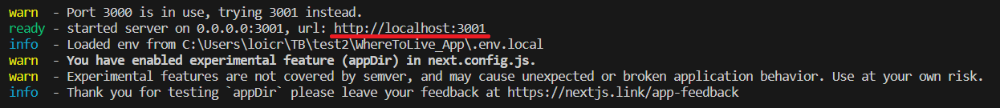
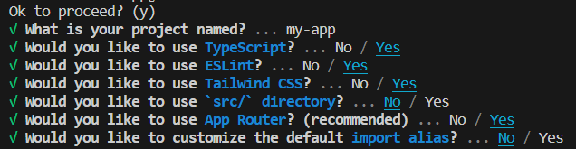

# TB_WhereToLive_App
Projet de Bachelor 2023 réalisé pour l'HEIG-VD.

Ce projet a été réalisé en parallèle de celui-ci : [https://github.com/loicrheig/WhereToLive_Cloud](https://github.com/loicrheig/WhereToLive_Cloud) et ils fonctionnent ensemble.

## Requirements
Node.js 16.8 or later.

## Introduction
Après avoir cloné le repository, il suffit de créer un fichier .env.local à la racine et d'y fournir les informations de connection à BigQuery sous la forme :

CLIENT_EMAIL="..."
CLIENT_ID="..."
PRIVATE_KEY="..."
PROJECT_ID="..."

CLIENT_EMAIL et PRIVATE_KEY doivent correspondre à un compte de services Google Cloud avec les rôles BigQuery Data Viewer et BigQuery Job User.

Le CLIENT_ID correspond à l'unique id du compte de services et est disponible dans sa page de détails. Le PROJECT_ID correspond à l'id du projet actuel Google Cloud et est disponible dans la fenêtre Cloud Overview.

Et finalement exécuter la commande : **npm install** afin de mettre en place tous les packages nécessaires qui sont visibles dans le fichier package.json.

## Démarrer l'application
Pour démarrer un serveur local, voici les commandes disponibles:
- npm run dev pour notamment avoir du hot reload. À utiliser dans une optique de développement
- npm run build va générer un build optimisé et une fois le build créé, npm run start peut être utilisé pour mettre en place un serveur simulant un environnement de production.

L'application est ensuite accessible à l'url indiqué : 

## Comment le projet a été généré
Pour créer un projet [Next.js](https://nextjs.org/), nous allons utiliser l'outil [`create-next-app`](https://github.com/vercel/next.js/tree/canary/packages/create-next-app).

Pour cela, ouvrez un terminal de commandes, déplacez-vous dans le dossier racine souhaité et utilisez la commande **npx create-next-app@latest  --experimental-app**. A savoir que si vous rencontrez des problèmes, vous pouvez toujours spécifier la version 13.4.12 qui fonctionne sans soucis avec **npx create-next-app@13.4.12  --experimental-app**.

Le flag experimental-app est expliqué en détail ici : [https://nextjs.org/docs/messages/experimental-app-dir-config](https://nextjs.org/docs/messages/experimental-app-dir-config).

Dans les options disponibles, acceptez l'utilisation de TypeScript, d'ESLint, de Tailwind CSS et d'App Router et refusez l'utilisation de src/ directory et import alias.

## Pour en savoir plus

Pour en savoir plus sur Next.js, consultez les ressources suivantes :

- [Next.js Documentation](https://nextjs.org/docs) - apprenez-en davantage sur les fonctionnalités et l'API de Next.js.
- [Learn Next.js](https://nextjs.org/learn) - un tutoriel interactif pour Next.js.

Vous pouvez consulter [le dépôt GitHub de Next.js](https://github.com/vercel/next.js/) - vos commentaires et contributions sont les bienvenus !

## Déploiement sur Vercel

La manière la plus simple de déployer votre application Next.js est d'utiliser [la plateforme Vercel](https://vercel.com/new?utm_medium=default-template&filter=next.js&utm_source=create-next-app&utm_campaign=create-next-app-readme) créée par les concepteurs de Next.js.

Consultez leur [documentation sur le déploiement de Next.js](https://nextjs.org/docs/deployment) pour plus de détails.
